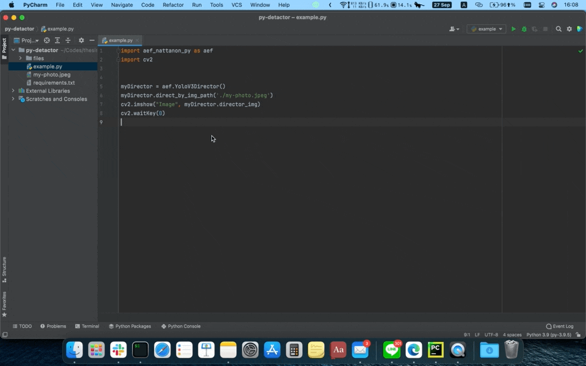

# aef-nattanon-py-lib
[](https://aef-nattanon-py-lib.readthedocs.io/en/latest/?badge=latest)
## Install

```bash
$ pip install aef-nattanon-py
```


## Simple Demo

```python
# Import aef_nattanon_py from your library
import aef_nattanon_py as aef
import cv2

# Multiplication
multiplication = aef.Multiplication(2)
print(multiplication.multiply(5)) # 10

# direct_by_img_path
myDetector = aef.Detector('coco.names', 'yolov3-tiny.cfg', 'yolov3-tiny.weights')
myDetector.detact_by_img_path('my-photo.jpeg')
cv2.imshow("Image", myDetector.detect_img)
cv2.waitKey(100)

# direct_by_frame
cap = cv2.VideoCapture(0)
while True:
    _, frame = cap.read()
    myDetector.detact_by_frame(frame)
    cv2.imshow("Image", myDetector.detect_img)
    cv2.waitKey(1)

cv2.destroyAllWindows()

# YoloV3Director
myDetector = aef.YoloV3Detector()
cap = cv2.VideoCapture(0)
while True:
    _, frame = cap.read()
    myDetector.detect_by_frame(frame)
    cv2.imshow("Image", myDetector.detect_img)
    cv2.waitKey(1)

cv2.destroyAllWindows()

```